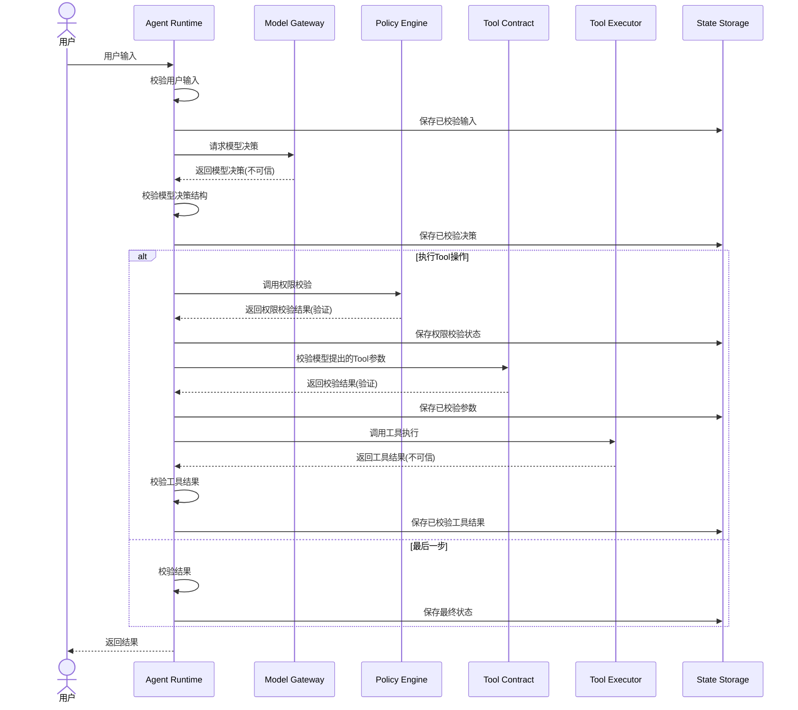

# 第 1 节作业答案

## 练习一：信任边界图


## 概念回答（必答）

请用自己的话逐条回答以下问题，不能只提交流程图或代码链接：

1. Agent 和 Chatbot 的核心区别是什么？
   Agent是一个完整的调用链，它会请求chatbot来让AI做决策，并根据AI返回的结果来判断要不要执行工具/继续loop 或是直接结束
   而Chatbot只是对AI Model发起的一次请求，AI Model可以回答问题，请求响应后就结束了，不能loop来判断是否要执行工具，是否要继续loop

2. Agent 和固定 Workflow 的核心区别是什么？
   Agent更加自由，它会让大模型来推断下一步该做什么，而workflow的流程是固定的；我们可以给agent注册多个tool, 给多个skill，让Agent自由判断要用哪个skill/tool; 而workflow通常是针对单一场景，比如 订火车票 -> 如果有票 -> 给出车票列表，并给出推荐的车次 -> 询问用户是否要下单等等

3. 为什么模型只能提出工具调用建议，不能直接执行工具？
   因为模型无从得知用户是否有权限调用工具，也不能精准校验工具的输入输出参数

4. `run.started`、`model.decision` 和 `run.completed` 分别在什么时机触发，主要供谁使用？
   `run.started` 在用户输入通过校验、Runtime 创建好任务状态后触发，表示一次运行已经开始。它可以被 React UI、日志系统和监控系统消费，用于显示运行开始和建立运行记录。

   `model.decision` 在模型返回结果并且 Runtime 完成决策结构校验后触发，表示模型提出了最终回答还是工具调用建议。事件只包含决策类型和工具名称摘要，不代表工具已经执行。

   `run.completed` 只在 Runtime 得到并返回最终答案后触发。工具调用分支只是返回待执行调用，因此不能发送 `run.completed`。

5. 为什么公共事件是给 UI、日志和监控消费的观察钩子，而不是模型的决策输入？
   公共事件是 Runtime 已经发生事实的受控摘要，消费方是 UI、日志和监控系统。它们不会被重新拼接进 `ContextBuilder`，也不是发给模型的指令，因此不会成为模型下一步决策的输入。即使事件消费者需要展示状态，权限校验、工具执行和状态更新仍然由 Runtime 负责。

6. Agent 至少需要哪些停止条件？请至少列出三个，并说明它们防止什么问题。
   1. 最大步骤数：达到上限后停止，防止模型反复调用工具形成死循环。
   2. 最大运行时间或超时：超过时间预算后取消运行，防止请求长期占用线程、连接和模型资源。
   3. 最大上下文/Token 或成本预算：超过预算后停止，防止上下文无限增长、请求超过模型限制或产生不可控费用。
   4. 用户取消、连续工具失败或重复调用：检测到取消、持续失败或相同调用重复出现时停止，防止无效重试和异常运行。

## 当前尚未实现的安全能力

本节只完成 Runtime 边界和一次模型决策，当前尚未实现：

- 认证：无法确认调用者身份。
- 授权：尚未实现基于用户、资源归属和租户的权限校验。
- 持久化：`State Storage` 只是边界设计，还没有真正的安全持久化和数据保留策略。
- 速率限制：尚未限制用户、租户或工具调用频率。

此外，工具参数目前只做结构校验，尚未根据具体工具的 Schema 做完整校验。

## 练习二：校验规则说明

### 规则 1

实现位置：https://gitkraken.dev/link/dnNjb2RlOi8vZWFtb2Rpby5naXRsZW5zL2xpbmsvci9hYjgwYjYxMzllZTE0ZTU5ODU1NGUyNjhmMjE2NjU3ZDFlODQ1MzA2L2YvY291cnNlcy93ZWVrLTAxL2xlc3Nvbi0wMS1hZ2VudC1ydW50aW1lLWludHJvZHVjdGlvbi9pbXBsZW1lbnRhdGlvbi9sZXNzb24tb25lLXJ1bnRpbWUudHM%2FdXJsPWdpdCU0MGdpdGh1Yi5jb20lM0F3bWl1cCUyRnVuaXZlcnNhbC10b29sLWFnZW50LXJ1bnRpbWUuZ2l0JmxpbmVzPTExNC0xMjE%3D?origin=gitlens

测试：https://gitkraken.dev/link/dnNjb2RlOi8vZWFtb2Rpby5naXRsZW5zL2xpbmsvci9hYjgwYjYxMzllZTE0ZTU5ODU1NGUyNjhmMjE2NjU3ZDFlODQ1MzA2L2YvY291cnNlcy93ZWVrLTAxL2xlc3Nvbi0wMS1hZ2VudC1ydW50aW1lLWludHJvZHVjdGlvbi90ZXN0cy9sZXNzb24tb25lLXJ1bnRpbWUudGVzdC50cz91cmw9Z2l0JTQwZ2l0aHViLmNvbSUzQXdtaXVwJTJGdW5pdmVyc2FsLXRvb2wtYWdlbnQtcnVudGltZS5naXQmbGluZXM9NjYtODk%3D?origin=gitlens

### 规则 2

实现位置：https://gitkraken.dev/link/dnNjb2RlOi8vZWFtb2Rpby5naXRsZW5zL2xpbmsvci9hYjgwYjYxMzllZTE0ZTU5ODU1NGUyNjhmMjE2NjU3ZDFlODQ1MzA2L2YvY291cnNlcy93ZWVrLTAxL2xlc3Nvbi0wMS1hZ2VudC1ydW50aW1lLWludHJvZHVjdGlvbi9pbXBsZW1lbnRhdGlvbi9sZXNzb24tb25lLXJ1bnRpbWUudHM%2FdXJsPWdpdCU0MGdpdGh1Yi5jb20lM0F3bWl1cCUyRnVuaXZlcnNhbC10b29sLWFnZW50LXJ1bnRpbWUuZ2l0JmxpbmVzPTEyMi0xMjk%3D?origin=gitlens

测试：https://gitkraken.dev/link/dnNjb2RlOi8vZWFtb2Rpby5naXRsZW5zL2xpbmsvci9hYjgwYjYxMzllZTE0ZTU5ODU1NGUyNjhmMjE2NjU3ZDFlODQ1MzA2L2YvY291cnNlcy93ZWVrLTAxL2xlc3Nvbi0wMS1hZ2VudC1ydW50aW1lLWludHJvZHVjdGlvbi90ZXN0cy9sZXNzb24tb25lLXJ1bnRpbWUudGVzdC50cz91cmw9Z2l0JTQwZ2l0aHViLmNvbSUzQXdtaXVwJTJGdW5pdmVyc2FsLXRvb2wtYWdlbnQtcnVudGltZS5naXQmbGluZXM9OTEtMTE0?origin=gitlens


### 规则 3

实现位置：https://gitkraken.dev/link/dnNjb2RlOi8vZWFtb2Rpby5naXRsZW5zL2xpbmsvci9hYjgwYjYxMzllZTE0ZTU5ODU1NGUyNjhmMjE2NjU3ZDFlODQ1MzA2L2YvY291cnNlcy93ZWVrLTAxL2xlc3Nvbi0wMS1hZ2VudC1ydW50aW1lLWludHJvZHVjdGlvbi9pbXBsZW1lbnRhdGlvbi9sZXNzb24tb25lLXJ1bnRpbWUudHM%2FdXJsPWdpdCU0MGdpdGh1Yi5jb20lM0F3bWl1cCUyRnVuaXZlcnNhbC10b29sLWFnZW50LXJ1bnRpbWUuZ2l0JmxpbmVzPTE1Ny0xNjE%3D?origin=gitlens

测试：https://gitkraken.dev/link/dnNjb2RlOi8vZWFtb2Rpby5naXRsZW5zL2xpbmsvci9hYjgwYjYxMzllZTE0ZTU5ODU1NGUyNjhmMjE2NjU3ZDFlODQ1MzA2L2YvY291cnNlcy93ZWVrLTAxL2xlc3Nvbi0wMS1hZ2VudC1ydW50aW1lLWludHJvZHVjdGlvbi90ZXN0cy9sZXNzb24tb25lLXJ1bnRpbWUudGVzdC50cz91cmw9Z2l0JTQwZ2l0aHViLmNvbSUzQXdtaXVwJTJGdW5pdmVyc2FsLXRvb2wtYWdlbnQtcnVudGltZS5naXQmbGluZXM9MTE0LTE5Mg%3D%3D?origin=gitlens


### 规则 4

实现位置：https://gitkraken.dev/link/dnNjb2RlOi8vZWFtb2Rpby5naXRsZW5zL2xpbmsvci9hYjgwYjYxMzllZTE0ZTU5ODU1NGUyNjhmMjE2NjU3ZDFlODQ1MzA2L2YvY291cnNlcy93ZWVrLTAxL2xlc3Nvbi0wMS1hZ2VudC1ydW50aW1lLWludHJvZHVjdGlvbi9pbXBsZW1lbnRhdGlvbi9sZXNzb24tb25lLXJ1bnRpbWUudHM%2FdXJsPWdpdCU0MGdpdGh1Yi5jb20lM0F3bWl1cCUyRnVuaXZlcnNhbC10b29sLWFnZW50LXJ1bnRpbWUuZ2l0JmxpbmVzPTEzMC0xMzU%3D?origin=gitlens

测试：https://gitkraken.dev/link/dnNjb2RlOi8vZWFtb2Rpby5naXRsZW5zL2xpbmsvci9hYjgwYjYxMzllZTE0ZTU5ODU1NGUyNjhmMjE2NjU3ZDFlODQ1MzA2L2YvY291cnNlcy93ZWVrLTAxL2xlc3Nvbi0wMS1hZ2VudC1ydW50aW1lLWludHJvZHVjdGlvbi90ZXN0cy9sZXNzb24tb25lLXJ1bnRpbWUudGVzdC50cz91cmw9Z2l0JTQwZ2l0aHViLmNvbSUzQXdtaXVwJTJGdW5pdmVyc2FsLXRvb2wtYWdlbnQtcnVudGltZS5naXQmbGluZXM9MTk1LTI0MQ%3D%3D?origin=gitlens


### 规则 5

实现位置：https://gitkraken.dev/link/dnNjb2RlOi8vZWFtb2Rpby5naXRsZW5zL2xpbmsvci9hYjgwYjYxMzllZTE0ZTU5ODU1NGUyNjhmMjE2NjU3ZDFlODQ1MzA2L2YvY291cnNlcy93ZWVrLTAxL2xlc3Nvbi0wMS1hZ2VudC1ydW50aW1lLWludHJvZHVjdGlvbi9pbXBsZW1lbnRhdGlvbi9sZXNzb24tb25lLXJ1bnRpbWUudHM%2FdXJsPWdpdCU0MGdpdGh1Yi5jb20lM0F3bWl1cCUyRnVuaXZlcnNhbC10b29sLWFnZW50LXJ1bnRpbWUuZ2l0JmxpbmVzPTExMC0xMTI%3D?origin=gitlens

测试：https://gitkraken.dev/link/dnNjb2RlOi8vZWFtb2Rpby5naXRsZW5zL2xpbmsvci9hYjgwYjYxMzllZTE0ZTU5ODU1NGUyNjhmMjE2NjU3ZDFlODQ1MzA2L2YvY291cnNlcy93ZWVrLTAxL2xlc3Nvbi0wMS1hZ2VudC1ydW50aW1lLWludHJvZHVjdGlvbi90ZXN0cy9sZXNzb24tb25lLXJ1bnRpbWUudGVzdC50cz91cmw9Z2l0JTQwZ2l0aHViLmNvbSUzQXdtaXVwJTJGdW5pdmVyc2FsLXRvb2wtYWdlbnQtcnVudGltZS5naXQmbGluZXM9MjQyLTI4Ng%3D%3D?origin=gitlens

## 练习三：公共事件设计

请在下面列出 `run.started`、`model.decision` 和 `run.completed` 的 TypeScript 字段定义，并说明每个事件的：
```ts
export type AgentEvent =
  | {
      readonly type: "run.started";
      readonly runId: string;
      readonly inputLength: number;
      readonly occurredAt: number;
    }
  | {
      readonly type: "model.decision";
      readonly runId: string;
      readonly decisionType: ModelDecision["type"];
      readonly toolNames?: readonly string[];
      readonly occurredAt: number;
    }
  | {
      readonly type: "run.failed";
      readonly runId: string;
      readonly name: string;
      readonly message: string;
      readonly occurredAt: number;
    }
  | {
      readonly type: "run.completed";
      readonly runId: string;
      readonly resultType: "final";
      readonly occurredAt: number;
    }
  | {
      readonly type: "run.cancelled",
      readonly runId: string;
      readonly occurredAt: number;
  }
```
`run.started`：输入通过校验且 Runtime 创建任务状态后触发，供 UI、日志和监控显示运行开始。只记录 `runId`、输入长度和时间，不记录完整用户输入。

`model.decision`：模型响应通过 Runtime 结构校验后触发，供 UI、日志和监控展示决策摘要。只记录决策类型和工具名称，不记录工具参数、完整上下文或隐藏思维过程。

`run.failed`：Runtime 或依赖执行失败时触发，供日志和监控记录失败状态。错误消息必须是通用安全消息，不能直接使用供应商异常原文。

`run.completed`：Runtime 得到最终答案并成功返回时触发。工具调用分支不发送该事件。

`run.cancelled`：用户或上游明确取消任务后触发，只记录运行 ID 和时间。


## 自测结果

```text
✔ 模型返回 final 时，Runtime 返回最终结果 (3.453125ms)
✔ 工具id无效 (0.35575ms)
✔ 工具名称无效 (0.729ms)
✔ 工具调用数据不能超过8个 (0.152458ms)
✔ 工具调用参数校验 (0.230708ms)
✔ 工具调用参数校验 (0.148291ms)
✔ 工具格式校验 (0.087666ms)
✔ 工具格式校验 (0.076375ms)
✔ 模型返回工具调用时，Runtime 返回待执行调用 (0.314166ms)
✔ 空输入应该被拒绝 (0.275375ms)
✔ 超长输入应该被拒绝且不能调用模型 (0.116542ms)
✔ 工具调用 id 超过128个字符应该被拒绝 (0.123708ms)
✔ 工具名称超过100个字符应该被拒绝 (0.073708ms)
✔ 工具调用 id 和名称的最大长度应该允许通过校验 (0.056166ms)
✔ 非法模型决策应该被拒绝并记录失败事件 (0.07025ms)
✔ 任务在进入模型前被取消 (0.082125ms)
✔ 测试run.started (0.07275ms)
✔ final 决策按 started、decision、completed 顺序发事件 (0.058458ms)
✔ 工具调用决策不应发出 run.completed (0.057291ms)
✔ 依赖错误信息不会进入 run.failed 事件
✔ AgentRuntimeError 会过滤疑似 secret
Waiting for the debugger to disconnect...
ℹ tests 21
ℹ suites 0
ℹ pass 21
ℹ fail 0
ℹ cancelled 0
ℹ skipped 0
ℹ todo 0
ℹ duration_ms 79.236334
```
