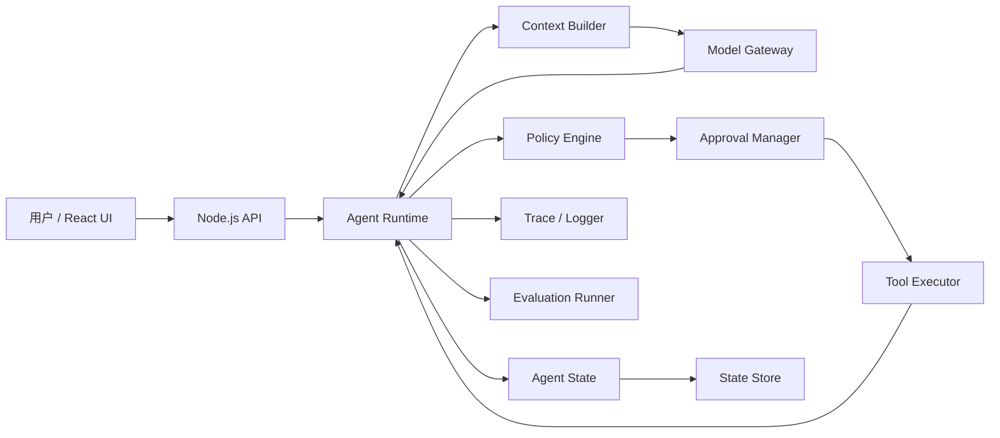

# 第 1 周 · 第 1 节：Agent 是什么，以及我们要手写的 Runtime

## 1. 本节学习目标

完成本节后，你应该能够：

- 区分 Chatbot、Workflow 和 Agent。
- 解释 Agent Loop 的基本工作方式。
- 说清楚模型、Runtime、工具之间的边界。
- 画出最终 Agent Runtime 的核心模块。
- 用 TypeScript 定义 Runtime 的第一版核心接口。
- 明确哪些能力必须自己实现，哪些能力可以依赖基础库。

## 2. 前置知识

本节需要：

- TypeScript interface、union type
- Promise、async/await
- Node.js 模块和 HTTP API 的基本概念
- 前端应用中的状态管理思想

本节暂时不要求 Python、向量数据库或高级 Agent 框架。

## 3. Agent、Chatbot 和 Workflow

### Chatbot

Chatbot 通常是：

```text
用户消息 → 模型 → 文本回复
```

模型主要负责生成答案，系统不一定执行外部动作。

### Workflow

Workflow 是预先确定好的流程：

```text
读取订单 → 校验库存 → 创建支付 → 发送通知
```

每一步通常由程序代码确定，路径相对固定、可预测、容易测试。

### Agent

Agent 的核心特征是：

> 模型可以根据当前状态，决定下一步是继续回答、调用工具，还是结束任务。

基本过程是：

```text
用户请求
  ↓
Runtime 构建上下文
  ↓
模型决定下一步
  ↓
Runtime 执行工具
  ↓
工具结果回写状态
  ↓
模型再次决定下一步
  ↓
结束或继续
```

因此：

> 模型只能提出行动建议，不能直接执行工具。真正执行工具的是我们编写的 Runtime。

## 4. Agent 的最小定义

本课程采用下面的定义：

> Agent = 模型决策能力 + 工具执行能力 + 状态管理 + 终止控制

一个 Agent 至少需要回答四个问题：

1. 当前任务状态是什么？
2. 模型可以看到哪些上下文？
3. 模型建议执行什么动作？
4. 什么条件下任务必须停止？

Agent 不是一个 API 调用，也不是一个 Prompt，而是一个受约束的运行时系统。

### Agent Loop 的最小工作方式

Agent Loop 的职责是反复驱动“模型决策 → Runtime 校验 → 工具执行 → 状态回写”，直到模型给出最终答案，或者触发停止条件。伪代码如下：

```text
创建 Agent State

while 没有达到停止条件：
  decision = ModelGateway.complete(ContextBuilder.build(state))
  Runtime 校验 decision

  if decision 是 final：
    返回最终答案

  for call in decision.calls：
    检查工具是否存在
    检查权限、审批和参数
    Tool Executor 执行工具
    将工具结果写回 state

达到停止条件时：
  返回失败、取消或超限结果
```

模型只负责提出 `decision`。循环、校验、权限、执行、状态更新和停止条件都属于 Runtime 的职责。本节的代码只实现一次模型决策，并在模型要求调用工具时返回待执行调用；完整 Agent Loop 会在后续课程实现。

## 5. 我们要手写的 Agent Runtime



核心模块及职责：

| 模块 | 职责 |
|---|---|
| Model Gateway | 屏蔽不同模型厂商的 API 差异 |
| Agent Loop | 驱动“模型决策 → 工具执行 → 结果回写” |
| Tool Registry | 注册、查找和描述工具 |
| Tool Contract | 定义工具参数、返回值和副作用 |
| Tool Executor | 实际执行工具并捕获错误 |
| Policy Engine | 判断工具是否允许执行 |
| Approval Manager | 处理人工审批 |
| Agent State | 保存任务当前状态 |
| State Store | 持久化状态 |
| Event Log | 记录状态变化 |
| Context Builder | 组装发送给模型的上下文 |
| Memory Manager | 处理短期和长期记忆 |
| Planner | 将复杂任务拆成步骤 |
| Stop Policy | 防止死循环、超步数和异常运行 |
| Retry/Timeout/Cancel | 处理可靠性问题 |
| Trace | 记录每次模型和工具调用 |
| Evaluation Runner | 执行测试集和质量评估 |
| Node API | 对外提供任务接口 |
| React UI | 展示流式状态和工具结果 |

### 信任边界与数据所有权

Runtime 是用户、模型和工具之间的可信控制点。外部数据即使看起来符合预期，也必须在进入下一条可信代码路径前重新校验。

| 数据或动作 | 是否可信 | 主要责任方 |
|---|---|---|
| 用户输入 | 不可信 | Runtime 做类型、长度和内容边界校验 |
| 模型输出 | 不可信 | Runtime 做决策结构校验 |
| 工具参数 | 不可信 | Tool Contract 做 Schema 校验 |
| 工具是否允许执行 | 不能由模型决定 | Policy Engine 和 Approval Manager |
| 工具实际执行 | 可信代码路径 | Tool Executor |
| Agent 当前状态 | Runtime 的事实来源 | Agent State / State Store |
| 对外事件 | 受控输出 | Event Sink 做脱敏和字段限制 |

本节只建立模块边界，不实现完整 Agent Loop。

## 6. 四条核心架构原则

### 原则一：模型不是权限系统

模型返回工具调用并不代表系统应该执行它。Runtime 必须继续检查工具是否存在、参数是否合法、用户是否有权限、是否需要审批、是否超出预算以及任务是否已经取消。

### 原则二：所有外部输入都不可信

需要验证的输入包括用户输入、模型输出、工具参数、工具返回值、数据库中的历史状态、外部 HTTP 响应和文档内容。

不能直接把模型结果强制转换成业务类型：

```ts
const args = modelResponse.arguments as DeleteUserArgs;
```

后续必须经过 Schema 校验。

### 原则三：State 是 Runtime 的事实来源

任务状态需要能够表达任务是否运行中、当前步骤、消息、调用过的工具、工具结果、审批状态、失败和取消状态。后续会把 State 与 Event Log 分开设计。

### 原则四：必须有明确的停止条件

至少需要支持最终答案、最大步骤数、最大时间、成本预算、用户取消、连续工具失败和重复调用等停止条件。

## 7. TypeScript 第一版核心接口

完整示例位于：

- [`implementation/lesson-one-runtime.ts`](./implementation/lesson-one-runtime.ts)

本节实现的最小流程是：

```text
校验用户输入
  ↓
创建 Agent State
  ↓
构建上下文
  ↓
调用 Model Gateway
  ↓
校验模型决策
  ↓
返回最终答案或待执行工具调用
```

核心联合类型如下：

```ts
export type ModelDecision =
  | {
      readonly type: "final";
      readonly text: string;
    }
  | {
      readonly type: "tool_calls";
      readonly calls: readonly ToolCall[];
    };
```

`ToolCall.arguments` 使用 `unknown`，因为模型返回的数据是不可信输入，不能直接当作业务参数使用。

运行时校验需要区分三个层次：

1. **结构校验**：检查决策类型、字段类型、字符串长度和数组数量。本节的 `assertModelDecision` 主要负责这一层。
2. **工具契约校验**：根据具体工具的 `inputSchema` 检查参数是否符合工具要求。本节只保留接口，尚未实现真正的 Schema 校验。
3. **策略校验**：检查工具是否已注册、用户是否有权限、是否需要审批、是否超出预算，以及任务是否已经取消。这些检查不能交给模型决定。

TypeScript 类型只在编译阶段提供帮助。模型响应来自网络或供应商 API，运行时仍然必须把它当作 `unknown` 重新校验；类型断言不会执行任何校验：

```ts
const args = modelResponse.arguments as DeleteUserArgs;
```

上面的写法只改变编译器的看法，并不能证明 `arguments` 真的符合 `DeleteUserArgs`。

本节故意没有实现工具执行、Agent Loop、参数 Schema、权限、Retry、Timeout、Memory 和持久化；这些能力会在后续逐步加入。

## 8. 关键代码解释

- `ModelGateway` 只描述模型能力，不绑定具体厂商。
- `ToolRegistry` 只提供工具描述，本节不负责执行工具。
- `ContextBuilder` 是模型上下文的唯一组装入口，避免在各处拼接消息。
- `AgentState` 保存任务的最小运行状态。
- `assertModelDecision` 对模型返回值做运行时验证。
- `AgentEvent` 只记录公共执行状态，不记录隐藏思维过程。
- 日志只记录输入长度、决策类型和工具名称等摘要，避免泄露原始用户数据和凭据。

### 公共事件的用途

`AgentState` 是 Runtime 内部保存的当前状态；公共事件则是 Runtime 对外发布的、已经发生的事实。React UI、日志系统和监控系统可以消费这些事件，但事件本身不是给模型的指令，也不能代替 Runtime 的权限校验和状态管理。

事件传输层不属于本节的实现范围。后续可以由 `EventSink` 将事件交给 SSE、WebSocket 或其他 API 适配层，再由 React UI 消费：

```text
Runtime → EventSink → SSE / WebSocket / API → React UI
```

本节课后练习要求设计以下三个事件：

| 事件 | 触发时机 | 主要用途 | 可包含的摘要字段 |
|---|---|---|---|
| `run.started` | 输入通过校验、Runtime 创建任务后触发一次 | UI 显示任务开始运行，建立运行记录 | `runId`、`inputLength`、`occurredAt` |
| `model.decision` | 模型响应通过 Runtime 校验后触发一次 | UI 显示模型提出的是最终答案还是工具调用建议 | `runId`、`decisionType`、`toolNames`、`occurredAt` |
| `run.completed` | Runtime 得到最终答案并成功返回时触发一次 | UI 显示任务完成，记录结果状态 | `runId`、`resultType`、`textLength`、`occurredAt` |

一个不含工具调用的任务可以产生如下事件：

```text
run.started → model.decision → run.completed
```

如果模型返回工具调用，本节的 Runtime 会在发布 `model.decision` 后返回待执行调用，不会假装工具已经执行：

```text
run.started
  → model.decision
```

后续课程实现 Tool Executor 和 Agent Loop 后，才需要增加工具执行相关事件。当前三个事件只描述本节已经存在的运行、模型决策和最终结果生命周期。如果任务失败或被取消，应发布 `run.failed` 或 `run.cancelled`，不能把失败误报成 `run.completed`。工具参数默认不放入公共事件；如果确实需要记录，应只记录脱敏后的摘要，不能包含 API Key、Token、Cookie、完整用户输入或模型隐藏思维过程。

当前示例代码已经实现 `run.started`、`model.decision` 和 `run.failed`。`run.completed` 是最终答案分支可以补充的成功钩子；工具调用分支在本节只返回待执行调用，不发布工具已开始或已完成的事件。课后练习是在当前 Runtime 边界上设计公共事件接口。

## 9. 单元测试

测试文件位于：

- [`tests/lesson-one-runtime.test.ts`](./tests/lesson-one-runtime.test.ts)

当前测试覆盖：

- 模型返回最终答案时，Runtime 返回最终结果。
- 模型返回工具调用时，Runtime 返回待执行调用。
- 空输入被拒绝。
- 非法模型决策被拒绝并记录失败事件。
- 任务在进入模型前被取消。

### 为什么测试使用替身

本节测试使用假的 `ModelGateway`、`ToolRegistry` 和 `EventSink`，而不是连接真实模型供应商或执行真实工具。这样可以让测试稳定、快速，并且只验证 Runtime 自己的决策和校验逻辑：

- Fake `ModelGateway` 返回预先准备好的最终答案或非法决策。
- Fake `ToolRegistry` 提供固定的工具描述，不产生真实副作用。
- Fake `EventSink` 收集事件，便于断言 Runtime 是否发布了正确的状态。

测试不应依赖 API Key、网络、生产数据库或真实用户数据。真实模型和真实工具的集成测试属于后续课程。

### 取消与失败的边界

当前代码只覆盖“调用模型前已经取消”的情况。完整 Runtime 还需要把 `AbortSignal` 继续传给模型和工具，并处理执行过程中的取消：

- `run.failed` 表示 Runtime 或依赖执行失败。
- `run.cancelled` 表示用户或上游明确请求取消。
- 取消不能被误报为成功的 `run.completed`。
- 失败或取消事件应只记录错误类型、运行 ID 等摘要，不记录原始异常、凭据或完整上下文。

运行测试：

```bash
npm test
```

## 10. 常见错误

### 把 Agent 等同于 Prompt

Prompt 只是模型输入的一部分。Agent 还需要状态、工具、执行器、循环、权限、停止策略、观测和测试。

### 让模型直接执行工具

模型只能生成工具调用建议。Shell、文件、网络、数据库和消息发送都必须经过可信代码路径。

### 相信模型返回的 JSON

即使模型声称返回 JSON，也必须校验顶层结构、字段类型、字符串长度、数组数量、工具名称和工具参数。

### 第一版就引入多 Agent

当前目标是先实现一个可测试的单 Agent Runtime。多 Agent 会额外引入权限、路由、成本和失败传播问题。

### 把完整 Prompt 和原始模型输出写入日志

这可能造成隐私、密钥、业务数据和 Prompt Injection 内容泄露。应优先记录结构化摘要和脱敏字段。

## 11. 课后练习

详细要求位于 [`assignment.md`](./assignment.md)。本节包括：

1. 绘制 Model Gateway、Runtime、Tool Executor 的边界。
2. 完善模型工具调用的运行时校验。
3. 设计 `run.started`、`model.decision` 和 `run.completed` 公共事件。

## 12. 验收标准

详细清单位于 [`acceptance.md`](./acceptance.md)。完成后应能够解释 Agent 与 Chatbot 的区别、说明模型不能直接执行工具，并能够运行本节测试。

## 安全检查卡

- 入口：用户输入、模型返回值、事件输出。
- 信任边界：用户/模型 → Node.js Runtime。
- 敏感数据：用户消息、工具参数、模型上下文、模型供应商凭据。
- 当前防护：输入长度限制、模型决策结构校验、日志摘要化、安全随机 ID。
- 尚未实现：认证、授权、工具参数 Schema、超时、取消传播、持久化和速率限制。

这些未实现项是后续 Runtime 设计必须补齐的安全能力。

## 课程进度摘要

已完成：理解 Agent、Chatbot、Workflow 的区别；明确模型只负责提出决策，Runtime 负责执行；建立最终 Runtime 的模块边界；完成第一版 TypeScript 核心接口和基础测试。

当前项目状态：只有 Runtime 边界和模型决策抽象，尚未实现工具执行与 Agent Loop。

待完成：Tool Contract、参数校验、Tool Registry、Tool Executor。

下一节课：LLM API、消息结构，以及 Model Gateway 的厂商无关设计。
